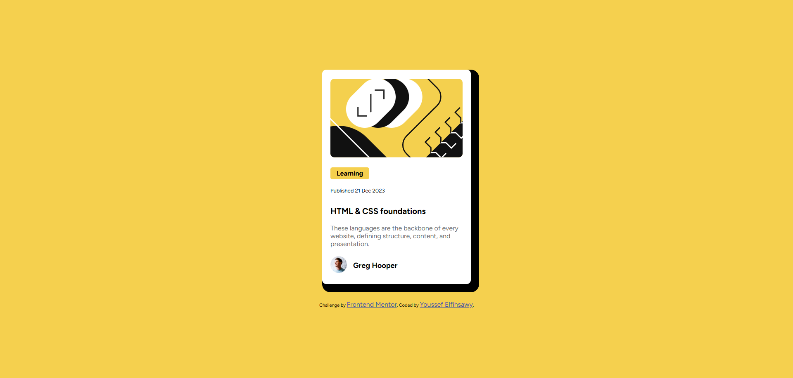
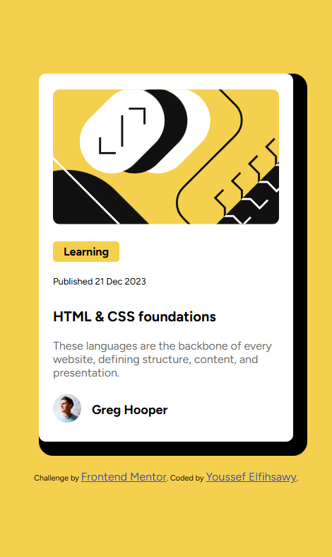

This is a solution to the [Blog preview card challenge on Frontend Mentor](https://www.frontendmentor.io/challenges/blog-preview-card-ckPaj01IcS). Frontend Mentor challenges help you improve your coding skills by building realistic projects.

## Table of contents

- [Overview](#overview)
  - [The challenge](#the-challenge)
  - [Screenshots](#screenshots)
  - [Links](#links)
- [My process](#my-process)
  - [Built with](#built-with)
  - [What I learned](#what-i-learned)
  - [Continued development](#continued-development)
  - [Useful resources](#useful-resources)
- [Author](#author)
- [Acknowledgments](#acknowledgments)

## Overview

### The challenge

Users should be able to:

- See hover and focus states for all interactive elements on the page

### Screenshots

#### Desktop Design



#### Mobile Design

<p align="center">
  
</p>

### Links

- Solution URL: [Add solution URL here](https://your-solution-url.com)
- Live Site URL: [Add live site URL here](https://your-live-site-url.com)

## My process

### Built with

- Semantic HTML5 markup
- CSS custom properties
- Flexbox
- CSS Grid
- Mobile-first workflow
- [React](https://reactjs.org/) - JS library
- [Next.js](https://nextjs.org/) - React framework
- [Styled Components](https://styled-components.com/) - For styles

### What I learned

One major learning from this project was how to effectively use CSS Grid to create responsive layouts. Below is an example snippet:

```css
.grid-container {
  display: grid;
  grid-template-columns: repeat(3, 1fr);
  gap: 20px;
}
```

### Continued development

I plan to continue focusing on improving my JavaScript skills, particularly in the area of asynchronous programming.

### Useful resources

- [CSS Tricks: A Complete Guide to Grid](https://css-tricks.com/snippets/css/complete-guide-grid/) - This guide was invaluable for understanding CSS Grid.

## Author

- LinkedIn - [Youssef Elfishawy](https://www.linkedin.com/in/youssef-elfishawy-4102241bb/)
- Frontend Mentor - [@youssefsafwat234](https://www.frontendmentor.io/profile/youssefsafwat234)

## Acknowledgments

Special thanks to the Frontend Mentor community for the feedback and support during the project.
